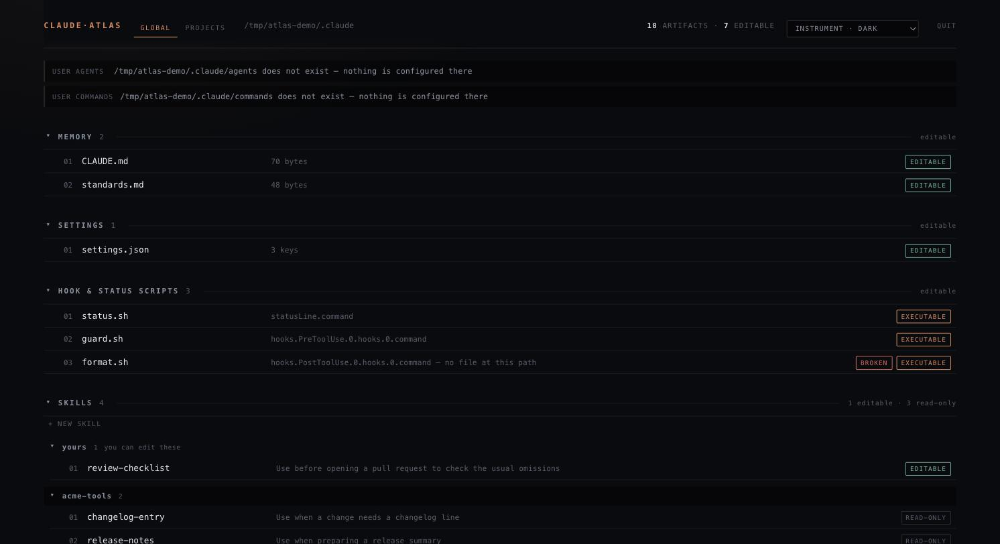
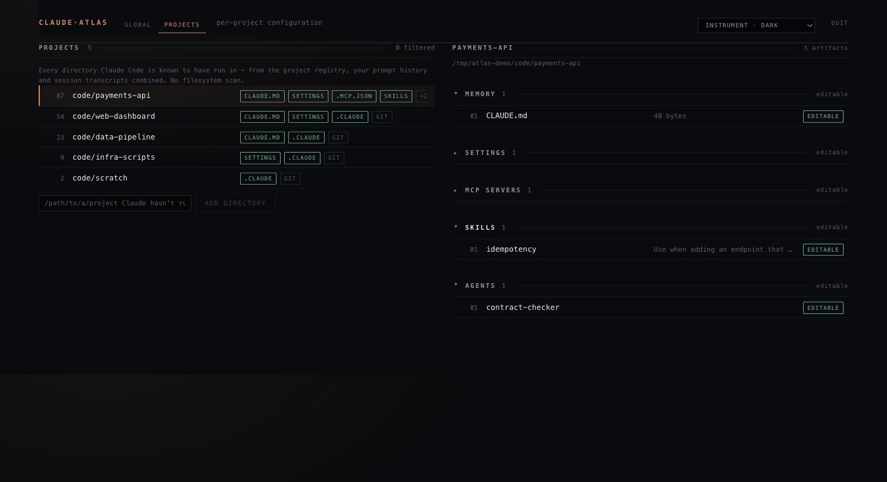

# claude-atlas

See and edit every Claude Code artifact on your machine — globally and per project.

**macOS only.** The parts that differ by platform — the Trash mechanism, filesystem case
folding — have only ever run on macOS, so the app refuses to start elsewhere rather than
half-working on files you rely on. Linux support is welcome; see `CONTRIBUTING.md`.

    git clone https://github.com/8ballbb/claude-atlas
    cd claude-atlas
    npm install        # also builds the UI
    npm start

Opens a local web UI at `http://127.0.0.1:7717/`. Stop it with Ctrl-C.

Reads `$CLAUDE_CONFIG_DIR` if set, otherwise `~/.claude`. Use `--port 7718` to move it;
the port is fixed rather than ephemeral so the URL survives a restart and can be
bookmarked. If the port is taken the server says so and names an alternative instead of
quietly moving.

Or without cloning:

    npx github:8ballbb/claude-atlas

> **Not** `npx claude-atlas` — that name on npm belongs to an unrelated project
> (`bernabranco/claude-atlas`). This one is not published to npm.

## What it shows

**Global** — your memory files with `@`-imports resolved, `settings.json`, the hook and
statusline scripts those settings execute, skills, agents, commands, and installed
plugins with drift status. Most of these arrive from plugins rather than from your own
directories, which is why tools that only read `~/.claude/skills` report nothing.

**Projects** — every directory Claude Code has actually run in, found by reading the
project registry, your prompt history and session transcripts. No filesystem scan. Each
project shows its own memory, settings, MCP servers, skills, agents, commands, rules, and
the hook scripts its settings execute. A repo that publishes a plugin is read in that
layout too, since its artifacts live at the repo root rather than under `.claude/`.

Items are grouped by kind and banded by owner, because ownership is what decides whether
you can change a thing. Everything starts folded; what you expand is remembered.

## What it refuses to do

An installed copy inside `plugins/cache/` is not editable — `claude plugin update`
overwrites that directory wholesale, so the app blocks the save rather than letting you
lose the work later. Managed policy, marketplace checkouts, session transcripts and
`~/.claude.json` are likewise read-only, each with the reason stated in the panel.

Deletion moves the file to the Trash via `/usr/bin/trash`. If that is unavailable the
deletion is refused — nothing here ever unlinks a file as a fallback, because the point of
deleting through this app is that it stays recoverable outside it.

## Broken configuration, said out loud

A hook whose script has been deleted is shown as broken rather than dropped — Claude Code
still fires it. A `settings.json` or `.mcp.json` that will not parse keeps its row and
reports the parse position, or says the parser did not give one rather than guessing. A
directory that could not be read is named, not counted. A plugin whose installed version
differs from its manifest says which is which.

## Editing

Unsaved edits survive every way of leaving a file — the close button, Escape, clicking
another artifact, switching page — each asks first.

**Preview changes** shows what a save would do before it touches disk, and the same diff
appears inside the confirmation for any file Claude Code executes as shell.

## Versions

Editable files can be versioned on demand with an explicit button — not on every save.
Versions live outside your config, in `~/.claude-atlas/versions/`, indexed so any file's
history can be found and restored.

**Compare** shows what restoring a version would change, before you restore it. Both
diffs are stated in the direction of the action: a `+` line is one the action adds. When
a comparison cannot be computed — an unreadable side, binary content, a file past the
size limit — it says so and why, and is never reported as "no change".

## Safety

- Binds `127.0.0.1` only. No tunnel, no LAN bind, no remote mode.
- Every API request must carry a matching `Origin` and `Host`, and every write must be
  `application/json`. Those three checks are what stop a page on another site from
  driving this API; see §9.2 of the spec for why there is no secret in the URL.
- No outbound requests. No telemetry, no account, no cloud, no LLM calls.
- Writing a file that Claude Code executes as shell requires a second confirmation
  naming the exact command, bound by HMAC to that file and that content.
- Every write is backed up beside the original at mode `0600`, under a lockfile, with a
  compare-and-swap against the on-disk content.

## Development

    npm install
    npm test          # 296 tests
    npm run lint
    npm run build     # required before the CLI can serve the UI

Node 20 or later, on macOS.

> Screenshots use a fabricated configuration, not a real one.

## Contributing

`CONTRIBUTING.md` for how to run it and what the codebase expects. `SECURITY.md` for the
threat model and how to report a vulnerability privately.

## Design

`docs/superpowers/specs/2026-09-11-claude-atlas-design.md` is the authority on behaviour
and is kept current with revision notes. `CLAUDE.md` records the invariants that are easy
to break and expensive to notice. Plans under `docs/superpowers/plans/completed/` are
spent history, not guidance.

## Licence

MIT. See `LICENSE`.
